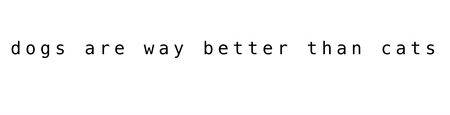

# sherlockAI

Another [AIND](https://www.udacity.com/course/artificial-intelligence-nanodegree--nd889) project, this time exploring how Recurrent Neural Nets can be used for all sorts of neat things like:

### Text Generation:



### Timeseries Prediction:


## Setup
This project requires Python 3 (Preferably as distributed by [Anaconda](https://www.continuum.io/downloads)) and [Tensorflow](https://www.tensorflow.org/) and [Keras](https://keras.io/).

```python
opencv-python==3.2.0.6
matplotlib==2.0.0
numpy==1.12.0
scipy==0.18.1
keras==2.0.2
scikit-learn==0.18.1
tensorflow==1.0.0
```

## Rubric

| Criteria       		|     Meets Specifications	        			            | 
|:---------------------:|:---------------------------------------------------------:| 
| Submission Files      |  RNN_project.ipynb, my_answers.py --> both the completed notebook  RNN_project.ipynb as well as all completed python functions requested in the main notebook RNN_project.ipynb (TODO items) should be copied into this python script and submitted for grading.		|

#### Step 1:  Implement a function to window time series
| Criteria       		|     Meets Specifications	        			            | 
|:---------------------:|:---------------------------------------------------------:| 
| Window time series data. |  The submission returns the proper windowed version of input time series of proper dimension listed in the notebook.  |


#### Step 2: Create a simple RNN model using keras to perform regression

| Criteria       		|     Meets Specifications	        			            | 
|:---------------------:|:---------------------------------------------------------:| 
| Build an RNN model to perform regression. |  The submission constructs an RNN model in keras with LSTM module of dimension defined in the notebook.        |


#### Step 3: Clean up a large text corpus

| Criteria       		|     Meets Specifications	        			            | 
|:---------------------:|:---------------------------------------------------------:| 
| Find and remove all non-english or punctuation characters from input text data.  The submission removes all non-english / non-punctuation characters.  |


#### Step 4: Implement a function to window a large text corpus

| Criteria       		|     Meets Specifications	        			            | 
|:---------------------:|:---------------------------------------------------------:| 
| Implement a function to window input text data| The submission returns the proper windowed version of input text of proper dimension listed in the notebook.  |


#### Step 5: Create a simple RNN model using keras to perform multiclass classification

| Criteria       		|     Meets Specifications	        			            | 
|:---------------------:|:---------------------------------------------------------:| 
| Build an RNN model to perform multiclass classification. |  The submission constructs an RNN model in keras with LSTM module of dimension defined in the notebook.        |


#### Step 6: Generate text using a fully trained RNN model and a variety of input sequences
| Criteria       		|     Meets Specifications	        			            | 
|:---------------------:|:---------------------------------------------------------:| 
| Generate text using a trained RNN classifier.   | The submission presents examples of generated text from a trained RNN module.  The majority of this generated text should consist of real english words. |

